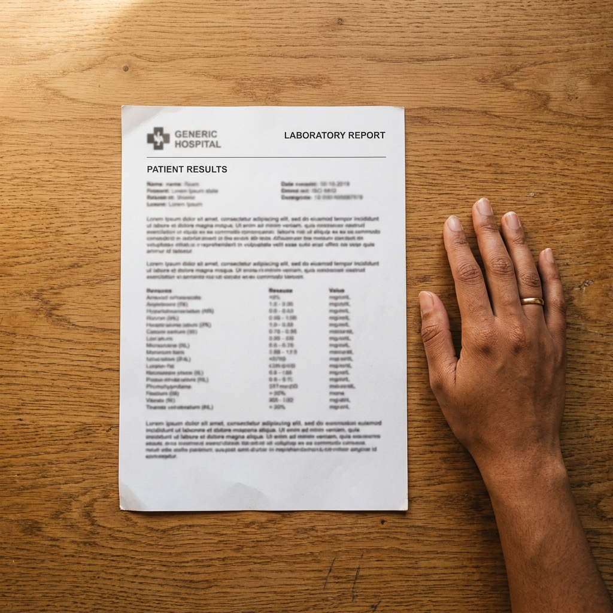

# UI/UX Context: Outsurance

Welcome to the frontend team! This document describes the actual built Next.js frontend — all routes, components, design tokens, and data flows — so you can understand and extend the codebase.

---

## Tech Stack

| Tool | Version | Role |
|---|---|---|
| **Next.js** | 16.2.6 (App Router) | Framework — all routing via `src/app/` |
| **React** | 19.2.4 | UI layer |
| **TypeScript** | Latest | Type safety throughout |
| **Tailwind CSS** | v4 + PostCSS | Utility-first styling |
| **GSAP + ScrollTrigger** | 3.x | Page load animations, parallax, pinned sections |
| **Framer Motion** | Latest | Component-level stagger and reveal animations |
| **Split-Type** | Latest | Per-character text animation |
| **Lucide React** | Latest | Icon set |
| **Supabase** | Latest | Auth (JWT) + PostgreSQL database |
| **Backend API** | FastAPI at `:8000` | ML pipeline, agent, stress test |

---

## 🎨 Design Philosophy

1. **Editorial / Antidesign**: The landing page uses Stripe/Linear-level editorial design — typography and whitespace are the primary design tools. Every pixel exists for clarity, not decoration.
2. **"Spotify for Insurance"**: Results framed as a "Match Score" (0–10), not a medical diagnosis. Feels like a personalized recommendation, not a form.
3. **Cinematic Motion**: GSAP orchestrates the landing page — cinematic loader, ScrollTrigger pins, parallax effects. Framer Motion handles component-level stagger on app screens.
4. **Trust & Privacy First**: Medical data handling feels secure and clinical. The privacy verification step (Step 4) is a centerpiece — make it feel safe.

**Primary color**: Sutera Green `#1E5B3B`  
**Typography**: Syne (display), Barlow Condensed (headings), Playfair Display (serif accent), JetBrains Mono / Space Mono (data), DM Sans (body)

---

## 📱 Routes & Screens

### Public Routes (No Auth Required)

#### `/` — Landing Page
**File**: `src/app/page.tsx` (1,482 lines)


- **Cinematic loader**: Staggered word animation ("Protection → Care → Peace of Mind"), fades out to reveal hero
- **Sticky navbar**: Glassmorphic, smooth anchor scroll, mobile hamburger with full-screen overlay
- **Section 1 — Hero**: Dynamic typewriter cycling ("YOUR HEALTH, always safe / protected / covered / assured"), SVG annotation system with hover tooltips, scroll arrow
- **Section 2 — How It Works**: 3-step diagonal layout, animated dashed curve connector, floating lab report image with parallax



- **Section 3 — Plan Showcase**: Horizontal scroll-locked carousel with 4 premium plan cards (GSAP ScrollTrigger pin)
- **Section 4 — Social Proof**: Cinematic golden-light image + stacked testimonial cards with 5-star ratings


- **Section 5 — CTA**: Full-width dark green container, animated text reveal, dual CTAs (Get Protected / See How It Works)
- **Footer**: 4-column layout, giant animated watermark text

---

#### `/login` — Login Page
**File**: `src/app/login/page.tsx` → delegates to `AuthSplitLayout` with `initialMode="login"`


- Split-panel: looping video on left, form on right
- Fields: email, password (show/hide toggle)
- GSAP panel slide + stagger animations
- On success → redirects to `/dashboard`

#### `/register` — Signup Page
**File**: `src/app/register/page.tsx` → delegates to `AuthSplitLayout` with `initialMode="signup"`

- Fields: full name, email, password, confirm password
- Real-time password strength indicator (weak / fair / strong)
- Terms checkbox required
- On success → success overlay → redirects to `/assessment`

---

### Authenticated Routes (Supabase JWT required)

#### `/assessment` — Health Assessment Flow
**File**: `src/app/assessment/page.tsx` (735 lines)

> **Screenshot**: Run `cd frontend && npm run dev`, navigate to `http://localhost:3000/assessment`, and save to `frontend/public/screenshots/assessment-step3.png`

**Step 1 — About You**
- Full name, DOB with live age calculation (DD/MM/YYYY), gender toggle, city autocomplete dropdown, annual income, monthly premium budget
- Budget warning if value seems unrealistically high

**Step 2 — Health Profile**
- Diabetes toggle, hypertension toggle, other chronic conditions counter (+/- buttons)

**Step 3 — Upload Report** *(The "Health Agent" screen)*
- Chat interface with AI advisor responses
- Document upload button (PDF) + photo upload button
- Manual entry option via chat
- Extracted vitals confirmation summary with confidence score
- *UX note*: upload buttons must be visually prominent; chat should feel conversational

**Step 4 — Confirm Details** *(The Privacy screen)*
- Full-width privacy lock banner: *"Your raw documents are never stored. Only these values will be sent."*
- Accuracy confidence indicator bar
- 2×3 editable input grid: HbA1c%, BP mmHg, BMI kg/m², tobacco toggle, chronic conditions range slider
- User can edit every value before anything goes to the server

**Step 5 — Finding Matches** *(Loading screen)*
- Rotating loader + cycling status messages ("Running XGBoost model...", "Ranking plans...", "Generating explanations...")
- On completion: redirects to `/dashboard?score=<risk_score>&tier=<risk_tier>`

**Right sidebar**: "My Health Profile" summary updating live as each step completes

---

#### `/dashboard` — Results Dashboard
**File**: `src/app/dashboard/page.tsx` (350 lines)

> **Screenshot**: Run `cd frontend && npm run dev`, navigate to `http://localhost:3000/dashboard`, and save to `frontend/public/screenshots/dashboard.png`

**Layout**: Sidebar + main content

**Risk Profile Card** (full-width, black background)
- Health risk tier: LOW / MODERATE / HIGH / CRITICAL
- 4-zone divided progress bar with indicator pointer at the user's score
- Numerical risk score (0–100)
- XGBoost feature importance breakdown below (which health factors drove the tier)

**Top Policy Matches** (3+ plan cards)
Each card shows:
- Match number, insurer badge, plan name
- Match score badge (e.g., 8.4/10) — colour-coded
- 3-column fact grid: Annual Premium | Coverage | Waiting Period
- AI reasoning block (Gemma 2-sentence plain-English explanation)
- Actions: **Plan Details** → `/explorer/[id]` | **Add to Compare** | **Stress Test**
- Amber warning flags as pill badges (e.g., "4-yr wait for diabetes cover", "20% co-payment")

**Right column**: "Why this matters" annotation box + My Health Numbers display

**Sticky bottom bar**: Appears when 2+ plans selected — shows "Compare Plans" and "Clear" buttons

**Modals**:
- `StressTestModal` — triggered from plan card "Stress Test" button
- `CompareDrawer` — triggered from sticky bottom bar or plan card "Add to Compare"

---

#### `/explorer` — Plan Explorer
**File**: `src/app/explorer/page.tsx` (556 lines)

> **Screenshot**: Save to `frontend/public/screenshots/explorer.png`

**Layout**: Left column (table) + right sidebar (active plan details)

**Header**: Search bar with clear button + sort dropdown (Match Score, Price Low→High, Price High→Low, Coverage)

**Filter Panel** (collapsible):
- Premium slider (₹3,600–₹25,000)
- Coverage slider (₹5L–₹5Cr)
- Plan type multi-select checkboxes (Basic, Standard, Comprehensive, Senior, Critical Illness)
- Provider/insurer multi-select checkboxes

**Active filter pills**: Shows applied filters with individual "×" removal + "Clear All"

**Plans Table**: Responsive — columns: Plan/Provider | Type | Premium | Coverage | Wait Period | Score
- Rows clickable to load sidebar details
- Compare badges on selected rows

**Right sidebar**: Policy Coverage Sheet with full plan facts + "Open Policy Breakdown", "Add to Compare", "Stress Test" actions

**Sticky bottom bar**: Appears when 2+ plans selected

---

#### `/explorer/[id]` — Plan Detail
**File**: `src/app/explorer/[id]/page.tsx` (332 lines)

> **Screenshot**: Save to `frontend/public/screenshots/plan-detail.png`

- Back link + insurer name badge in header
- Plan name + circular match score badge (60px, black background)
- Premium & Coverage card: yearly/monthly breakdown, 2-column split
- Key Features 2×2 grid: Wait for Health Conditions | Diabetes Day 1 | High BP Day 1 | Partner Hospitals count
- Plan Highlights: ✓ pros list + × cons list
- Coverage section: bulleted covered items
- Exclusions section: bulleted NOT covered items
- Emergency Cost Calculator card (with crosshair corner markers)
- **Sticky bottom bar**: "Save Plan" and "Add to Compare"
- Clicking emergency calculator opens `StressTestModal`

---

#### `/saved` — Saved Plans
**File**: `src/app/saved/page.tsx` (126 lines)

- 2-column responsive grid of bookmarked plan cards
- Empty state with annotation box + "Find Policies" CTA
- Each card: plan number, insurer, name, premium/coverage/wait facts, match score, Remove button
- Card click → navigates to plan detail

---

#### `/profile` — User Profile
**File**: `src/app/profile/page.tsx` (86 lines)

- My Details card: full name, email, account ID
- Privacy Matters annotation box
- Session Security card: Sign Out button (clears session → redirect to home)

---

## 🧩 Component Library (`src/components/`)

### `AuthSplitLayout.tsx` (290 lines)
Two-panel auth layout. Used by `/login` and `/register`.
- Left panel: looping MP4 video (`hero-video.mp4`, `login-hero.mp4`, `signup-hero.mp4`)
- Right panel: form with GSAP stagger animations
- Modal overlay for signup success

### `Sidebar.tsx` (225 lines)
Navigation for all authenticated pages.
- **Desktop**: Vertical sidebar — Logo, nav links (Dashboard, Plan Explorer, Saved Plans, Profile), "New Assessment" button, user initials badge, Sign Out
- **Mobile**: Sticky top bar with hamburger → full-screen drawer overlay
- Fetches user name/initials from Supabase on mount

### `StressTestModal.tsx` (259 lines)

> **Screenshot**: Trigger from any plan card → save to `frontend/public/screenshots/stress-test-modal.png`

- 5 scenario cards: Appendix ₹3L | ICU ₹8L | Cardiac ₹5L | Knee ₹4.5L | Maternity ₹2.5L
- Bill breakdown: Total cost → Insurance pays → Room rent penalty → Copay → **Your share**
- Status: Fully Covered / Moderate / High out-of-pocket (colour-coded)
- AI suggestion box if out-of-pocket is high
- All calculations are client-side (instant, no API call)

### `CompareDrawer.tsx` (220 lines)

> **Screenshot**: Select 2+ plans → trigger compare → save to `frontend/public/screenshots/compare-drawer.png`

- Bottom-sheet overlay
- Sticky left column with row labels; 2-3 plan columns
- 9 comparison rows: Premium | Coverage | Wait Period | Diabetes Day1 | Hypertension Day1 | Hospitals | Room Rent Cap | Claims Settlement % | Match Score
- "Best" values highlighted with neutral-100 background
- Actions: View Full Policy Details | Clear Selection

### `editorial.tsx` (101 lines)
Shared primitive exports used across all pages:
- `Crosshair` — decorative SVG mark with corner accents
- `HybridHeadline` — prefix + green accent + suffix text
- `FormField` — label + input wrapper
- `EditorialButton` — primary button with underline
- `SecondaryButton` — outline button
- `SectionEyebrow` — small uppercase eyebrow label
- `AnnotationBox` — info card with header/body
- `PageOverlay` — decorative hidden element

---

## 🔌 API Integration (`src/lib/api.ts`)

```ts
// POST health profile → risk tier + top-5 plan recommendations
assessHealthProfile(profile: UserProfile): Promise<AssessmentResult>

// GET all 20 insurance plans (with JSON fallback if backend is down)
fetchAllPlans(): Promise<Plan[]>

// POST stress test scenario for a specific plan
runStressTest(planId: number, scenario: string): Promise<StressTestResult>

// POST message to AI advisor chat
chatWithAdvisor(messages: Message[], session: AgentSession): Promise<AgentResponse>

// POST lab report text → extracted health metrics
processLabReport(text: string): Promise<ExtractedVitals>
```

**Agent session shape** (persist this in component state across the conversation):
```ts
{
  profile:       { age, hba1c, bp_systolic, bmi, smoker, has_diabetes, has_hypertension, chronic_count, monthly_budget, income_lakh },
  risk_data:     { risk_tier, risk_score, confidence_pct, feature_importance_explanation },
  current_plans: Plan[]
}
```

**What the UI does with `tool_result`:**

| `tool_used` | What to render |
|---|---|
| `reassess` | Replace plan cards with `tool_result.recommended_plans`; update risk card |
| `budget_sim` | Replace plan cards with `tool_result.recommended_plans` |
| `stress_test` | Show stress test result card inline in chat thread |
| `compare` | Open `CompareDrawer` with `tool_result.plans` |
| `explain_risk` | Show feature-importance breakdown inline |
| `plan_info` | Navigate to `/explorer/[id]` with `tool_result.plan` |

---

## 📊 Data Structures

### `/api/assess` Response
```json
{
  "risk_assessment": {
    "risk_tier": "Medium",
    "risk_score": 0.45,
    "confidence_pct": 82,
    "feature_importance_explanation": {
      "Age": 0.15,
      "Diabetes": 0.32,
      "BMI": 0.12
    }
  },
  "recommended_plans": [
    {
      "id": 1,
      "name": "Star Health Diabetes Safe",
      "match_score": 8.7,
      "premium": 14000,
      "coverage": 500000,
      "type": "Comprehensive",
      "explanation": "Because you have diabetes, this plan provides day-1 coverage with no waiting period.",
      "warning_flags": ["4-yr wait for hypertension cover", "20% co-payment on all claims"]
    }
  ]
}
```

### Warning Flags
Every plan in `/api/assess` and `/api/agent` includes a `warning_flags` array:
```json
"warning_flags": [
  "4-yr wait for diabetes cover",
  "5% co-payment on all claims"
]
```
Render these as **amber pill badges** below the match score on each plan card.

### Risk Tier Colours
Defined as CSS variables in `src/app/globals.css`:
- Low: `var(--color-risk-low)` — green
- Medium: `var(--color-risk-medium)` — amber
- High: `var(--color-risk-high)` — deep orange
- Critical: `var(--color-risk-critical)` — red

---

## 🛡️ Privacy Architecture


**Layer 1 — Device**: PDF text extraction via `pdfjs-dist` (runs in browser, zero server calls). Gemma OCR via `/api/extract` only if user uploads a photo. Raw documents never transmitted.

**Layer 2 — Backend**: Receives only 10 anonymised numeric values. Deletes temp vitals after assessment response. JWT-protected on every route.

**Layer 3 — Supabase**: Row-Level Security enforced at DB layer — users can only read their own rows. JWT tokens auto-refresh.

**Verifiable live**: During the demo, open DevTools → Network tab → upload a PDF → confirm zero PDF bytes appear in any request. Only the 10-value JSON body is sent to `/api/assess`.

---

## 🛠️ Areas of UX Polish Remaining

1. **Agent tool results in chat** — when `tool_used` is `stress_test` or `compare`, render a structured card inline in the chat thread, not just the text response string.
2. **Warning flag badges** — ensure amber pill badges from `warning_flags[]` are visible on every plan card in both Dashboard and Explorer.
3. **Empty states** — `/saved` empty state and Explorer zero-results state should feel inviting, not broken.
4. **Assessment progress persistence** — if user navigates back, all form fields should restore from `localStorage`/component state.
